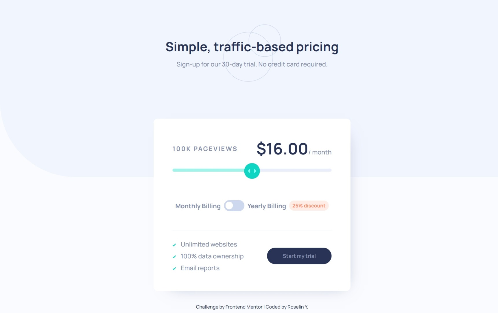

# Frontend Mentor - Interactive pricing component solution

This is a solution to the [Interactive pricing component challenge on Frontend Mentor](https://www.frontendmentor.io/challenges/interactive-pricing-component-t0m8PIyY8). Frontend Mentor challenges help you improve your coding skills by building realistic projects.

## Table of contents

- [Overview](#overview)
  - [The challenge](#the-challenge)
  - [Screenshot](#screenshot)
  - [Links](#links)
- [My process](#my-process)
  - [Useful resources](#useful-resources)
- [Author](#author)

## Overview

### The challenge

Users should be able to:

- View the optimal layout for the app depending on their device's screen size
- See hover states for all interactive elements on the page
- Use the slider and toggle to see prices for different page view numbers

### Screenshot

### Links

- Solution URL: [Add solution URL here](https://www.frontendmentor.io/solutions/interactive-pricing-component-html-css-js-NHFTWSn8qV)
- Live Site URL: [Add live site URL here](https://vanillatte68.github.io/interactive-pricing-component-main/)

## My process

### Useful resources

- [Box Shadow CSS Generator](https://www.cssmatic.com/box-shadow) - CSS box shadow generator for pricing box component.
- [Creating a custom CSS range slider with JavaScript upgrades - LogRocket](https://blog.logrocket.com/creating-custom-css-range-slider-javascript-upgrades/) - Custom range slider for HTML code reference.
- [CSS Glow Generator](https://cssbud.com/css-generator/css-glow-generator/) - CSS glow generator for slider thumb.

## Author

- Frontend Mentor - [Roselin Y](https://www.frontendmentor.io/profile/Vanillatte68)
